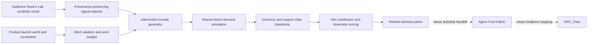

# Decision World

**An inspectable intervention-planning engine for product launches.** Decision World compares business actions across demand, price, inventory, support capacity, budgets, and contribution economics. It builds on [Audience Swarm Lab](https://github.com/AAH20/audience-swarm-lab) by accepting its synthetic aggregate output as an optional, explicitly labeled *what-if* demand assumption.

The v0.1 kernel runs offline with Python 3.11+ and no third-party runtime dependencies. It does **not** connect to live operations, purchase inventory, change prices, schedule employees, authenticate authority, or estimate real-world causal lift. Every proposed plan is `ADVISORY_ONLY_NOT_AUTHORIZED`.

## Reproduce the product-launch decision

```bash
python3 -m decision_world.cli fixtures/product-launch-world.json --output /tmp/decision-plan.json
python3 -m decision_world.cli fixtures/product-launch-world.json --audience-result fixtures/audience-result-small.json --output /tmp/decision-with-audience.json
python3 -m unittest discover -s tests -v
```

To connect the two local OSS projects end to end:

```bash
cd ../audience-swarm-lab
python3 -m audience_swarm_lab.cli simulate fixtures/offer-comparison.json --output /tmp/audience-signal.json
cd ../decision-world
python3 -m decision_world.cli fixtures/product-launch-world.json --audience-result /tmp/audience-signal.json --output /tmp/linked-plan.json
```

The demo world models a seven-day launch with 80 paired runs and four available interventions: a discount, a quality improvement, a support surge, and a marketing push. The engine enumerates bundles up to the configured limit, rejects plans violating setup/daily budgets or physical constraints, then ranks feasible plans by paired net-value lift adjusted for modeled downside. The fixture currently chooses **`support-surge`**. This result is an artifact of illustrative assumptions, not a business recommendation.

The result carries the world digest, source-signal digest when supplied, model version, evidence label, required capabilities, all feasible and rejected plans, cost assumptions, and per-run spread. No authority token or approval is fabricated.

## Architecture



The [architecture](docs/ARCHITECTURE.md) explains the state transitions, multi-agent and data integration path, contracts, and assurance boundary. The [benchmark and economics protocol](docs/BENCHMARKS_AND_ECONOMICS.md) defines what would establish value beyond synthetic demonstrations.

## Current implementation and boundaries

| Capability | Implemented now | Next gate |
| --- | --- | --- |
| Intervention search | Enumerate constrained bundles and rank paired outcomes | OR-Tools adapter for larger spaces |
| Synthetic world | Demand shocks, elasticity, inventory, support backlog, unit contribution | Calibrate to held-out real outcomes |
| Audience connection | Import labeled Audience Swarm Lab aggregate effects | Add independent-domain validity tests |
| Cost control | Work cap and hypothetical compute/storage meter | Actual provider and infrastructure telemetry |
| Agentic systems | Versioned interface boundary in architecture | LangGraph orchestrator and selective Jev/LLM policies |
| Governance | Required capabilities and advisory-only status | Authenticated Trust Fabric handoff and GRC evidence |
| Business intelligence | JSON result contract | Iceberg snapshots and continuous outcome ingestion |

This project complements the smaller [Audience Swarm Lab](https://github.com/AAH20/audience-swarm-lab), [Agent Trust Fabric](https://github.com/AAH20/agent-trust-fabric), and [GRC_Claw](https://github.com/AAH20/GRC_Claw). It does not import or copy their code. Upstream integrations retain their own licenses and terms.

## License

MIT. All fixtures are synthetic.
