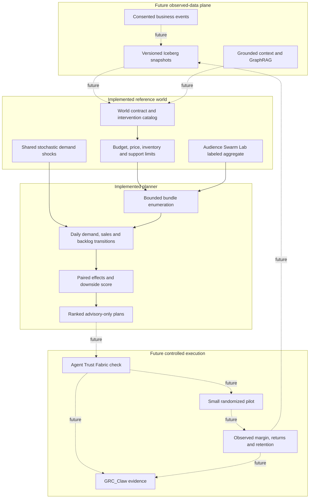

# Decision World architecture

Decision World is a closed-loop *design target*: observe, model, propose, simulate, optimize, authorize, test, and learn. Release 0.1 executes only the **model → simulate → optimize** portion with synthetic inputs. It makes no autonomous changes to production systems.

## Control and data planes



## Exact reference-world semantics

For each run, the engine samples one lognormal demand shock per day. Every candidate bundle uses **the same shock series**. Intervention demand lifts are multiplied. If an Audience Swarm Lab result provides a lift for an intervention, it replaces that intervention's configured lift. A matching imported offer effect also suppresses the reference price-elasticity effect for that same intervention so the offer response is not counted twice. Cross-intervention independence remains an explicit approximation.

Daily requested demand is the baseline demand times shock, intervention multipliers, and residual price elasticity. Sales are the smaller of requested demand and remaining inventory. Support tickets are modeled as sales times ticket rate; capacity clears current tickets and backlog; unresolved tickets incur a penalty for each day outstanding. Gross contribution is sales times price less unit cost. Net value deducts support capacity, base marketing, intervention setup/daily costs, and backlog penalties. All monetary values are fixture model units denominated as dollars for readability. They are **not calibrated prices or forecast cash flows**.

The planner enumerates candidate intervention bundles up to `max_interventions`. It rejects a bundle if setup or extra daily spend exceeds limits, price is nonpositive, ticket rate is outside zero to one, or support capacity is negative. For each feasible plan it reports run means and 5th/95th quantiles for units, unmet demand, ending backlog, ticket-days, contribution, costs, and net value. It also reports **paired** differences from baseline for sales, backlog, and net value. The risk-adjusted score is:

```text
mean(paired net-value lift)
  - risk_weight * max(0, -p05(paired net-value lift))
```

Baseline has score zero and wins when no intervention has a positive risk-adjusted score. Run quantiles describe spread in the **synthetic model**, not confidence intervals for the real market.

## Contracts and trust boundary

| Contract | Current fields | Trust statement |
| --- | --- | --- |
| `World` | Baseline demand, price, costs, inventory, support, shocks, interventions, limits, seed | Author-supplied assumptions |
| `AudienceSignal` | Source scenario hash, model version, arm relative lifts, synthetic label | Imported model output, not observed lift |
| `Plan` | Interventions, feasibility reasons, required capabilities, outcomes, paired effects | Advisory only; no action authority |
| `EvidenceManifest` | World hash, source hash, model version, work count | Reproducibility aid, not source authentication |

An eventual [Agent Trust Fabric](https://github.com/AAH20/agent-trust-fabric) handoff must carry **separately authenticated** actor, action, resource, time, delegation, amount, and approval. The current `required_capability` field names the capability a real execution would need; it is not a grant. GRC_Claw mapping should attest to the versioned world, approvals, actual execution records, and observed outcomes only after those sources exist.

## Agentic and scale-out path

1. Add a durable LangGraph supervisor to coordinate source review, proposal agents, simulation, optimization, independent criticism, and human review. The current catalog supplies proposals statically.
2. Add provider-neutral `DecisionPolicy` and `ContextProvider` interfaces. Jev should answer narrow typed questions; LLM agents should be sampled where they improve measured outcomes; deterministic policies remain the control arm.
3. Add OR-Tools for constrained search when the candidate space exceeds bounded enumeration. Keep the same world and score contract so solver results can be compared.
4. Add Iceberg snapshots for point-in-time inputs, provenance, deletion propagation, and outcome joins. Distribute runs only after profiling shows local execution is the bottleneck.
5. Run in shadow mode against real, consented data, then conduct a small randomized pilot. No real-world action should be triggered directly from a simulated ranking.

The public repository should retain the world schema, reference simulator, cost meter, benchmark harness, and adapters. A commercial deployment can charge for private connectors, managed scale, domain calibration, experiment operations, support, and audited execution. The public results must remain reproducible without commercial infrastructure.
